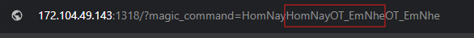

# CTF Write-Up: It's OT Time

## Mô tả: 
Thủ thách này sẽ truyền payload vào URL. Tuy nhiên bộ lọc payload đã được embed vào source code, phải tìm cách để bypass bộ lọc này

Khi truy cập URL bài CTF, ta sẽ thấy mục "View The Source", sau khi kiểm tra Source Code sơ bộ, thấy được nội dung bao gồm so sánh 2 biến:
    $what_you_actually_heard === $what_you_dont_want_to_hear

Trước hết, phân tích sâu hơi ta sẽ thấy nội dung gồm payload $_GET['magic_command'] --- ?magic_command
Nội dung cần truyền vào payload là $what_you_dont_want_to_hear = 'HomNayOT_EmNhe' ---> ?magic_command=HomNayOT_EmNhe
Tuy nhiên có 1 bộ lọc thay thế string HonNayOT_EmNhe bằng 1 string rỗng:
    $what_you_actually_heard = preg_replace(
    "/$what_you_dont_want_to_hear/",
    '',
    $what_he_said
    );
---> Khi tìm thấy chuỗi HomNayOT_EmNhe sẽ tự động replace bằng chuỗi trống''. ?magic_command=HomNayOT_EmNhe -> ?magic_command=''

Lúc này sẽ cần tìm 1 cách nào đó để bypass bộ lọc này, nhận thấy bộ lọc chỉ lọc 1 lần duy nhất tất cả các string 'HomNayOT_EmNhe', vậy nên việc nhập chuỗi 2 lần liên tục cũng sẽ không được (?magic_command=HomNayOT_EmNheHomNayOT_EmNhe). Vì vậy sẽ thử nhập chuỗi trong chuỗi, ví dụ: ?magic_command=HomNayHomNayOT_EmNheOT_EmNhe. Lúc này bộ lọc sẽ phát hiện như sau: ?magic_command=HomNay---HomNayOT_EmNhe---OT_EmNhe và xóa chuỗi ở giữa. Cuối cùng ta sẽ được payload ?magic_command=HomNayOT_EmNhe và được truyền đi đến server và lấy được flag

